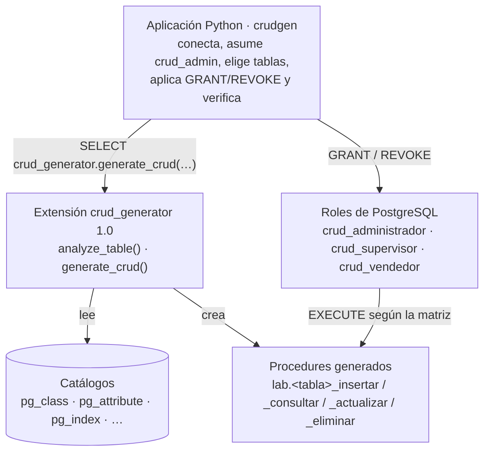

# CRUD Generator para PostgreSQL

[](https://github.com/Pochonski/CrudGenerator-PostgreSQL/actions/workflows/sql-harness.yml)


Generador automático de procedimientos **INSERT, READ, UPDATE y DELETE** para
cualquier tabla de PostgreSQL. Una **extensión** escrita en SQL + PL/pgSQL lee
los catálogos del sistema, entiende la estructura real de la tabla y crea los
procedures; una **aplicación Python** (CLI `crudgen`) orquesta el proceso y
asigna privilegios por rol con `GRANT`/`REVOKE` reales que PostgreSQL hace
cumplir.

> Primer proyecto — Bases de Datos II, Tecnológico de Costa Rica (2026).

**Repositorio:** <https://github.com/Pochonski/CrudGenerator-PostgreSQL>

```bash
git clone https://github.com/Pochonski/CrudGenerator-PostgreSQL.git
```

---

## Contenido

- [Qué hace](#qué-hace)
- [Arquitectura](#arquitectura)
- [Inicio rápido](#inicio-rápido)
- [Ejemplo de uso](#ejemplo-de-uso)
- [Modelo de seguridad](#modelo-de-seguridad)
- [Pruebas](#pruebas)
- [Estructura del repositorio](#estructura-del-repositorio)
- [Video de evidencia](#video-de-evidencia)
- [Equipo](#equipo)

## Qué hace

- **Descubre** esquemas, tablas y columnas desde `pg_namespace`, `pg_class`,
  `pg_attribute`, `pg_attrdef` y `pg_index`: nada está escrito a mano para una
  tabla en particular.
- **Genera** `lab.<tabla>_insertar`, `_consultar`, `_actualizar` y `_eliminar`
  con SQL dinámico seguro (`%I` / `%L`, `quote_ident`, `quote_nullable`).
- **Soporta** clave primaria simple y compuesta, columnas `IDENTITY` y
  `DEFAULT` (opcionales al insertar), tablas sin PK (READ con `refcursor`,
  UPDATE/DELETE `not_applicable`), y nombres con espacios o palabras reservadas.
- **Protege**: cada procedure es `SECURITY INVOKER` con `search_path` fijo y
  nace **sin** `EXECUTE` para `PUBLIC`.
- **Administra privilegios** desde la CLI: matriz rol × operación aplicada con
  `GRANT`/`REVOKE`, y verificación ejecutando cada procedure como cada rol.
- **Funciona con tablas nuevas**: una tabla creada después del desarrollo se
  genera sin tocar ni Python ni la extensión.

## Arquitectura



La lógica de generación vive en la base de datos; Python no contiene CRUD
específico de ninguna tabla.

## Inicio rápido

### Requisitos

- PostgreSQL 16 o superior (probado en 16 y 18)
- Python 3.11 o superior
- `psql` disponible en la terminal

### 1. Instalar la extensión

Linux / macOS (con PGXS):

```bash
cd extension
make install
```

Windows: copiar los dos archivos a la carpeta de extensiones de PostgreSQL
(PowerShell como administrador; ajustar la versión):

```powershell
Copy-Item extension\crud_generator.control, extension\sql\crud_generator--1.0.sql "C:\Program Files\PostgreSQL\18\share\extension\"
```

### 2. Preparar el laboratorio de ejemplo (opcional)

Crea los roles `crud_*` y el esquema `lab` con seis tablas de prueba:

```bash
psql -d devdb -f tests/fixtures/01_roles.sql
psql -d devdb -f tests/fixtures/02_schema.sql
```

### 3. Activar la extensión en la base

```sql
CREATE EXTENSION crud_generator;
GRANT USAGE ON SCHEMA crud_generator TO crud_admin;
```

### 4. Instalar y ejecutar la aplicación

```bash
python -m venv .venv
source .venv/bin/activate        # Windows: .venv\Scripts\activate
python -m pip install -e "./app[dev]"
crudgen
```

La aplicación se autentica con un usuario `LOGIN` capaz de hacer
`SET ROLE crud_admin` (`crud_admin` es `NOLOGIN`). La contraseña se pide con
`getpass` y nunca se muestra ni se guarda.

## Ejemplo de uso

Salida real de `crudgen` sobre `lab.producto` (PostgreSQL 18):

```text
Verificando extensión...
La extensión 'crud_generator' está instalada (versión 1.0, esquema crud_generator) …
Esquema [número]: 2
Tablas: 4
Operaciones: a
Reemplazar: n
Estructura de lab.producto:
- id_producto: integer, PK, NOT NULL
- nombre: text, no PK, NOT NULL
- precio: numeric(10,2), no PK, NOT NULL
Generación para producto:
- INSERT: success
  rutina: producto_insertar
- READ: success
  rutina: producto_consultar
…
```

Después, los procedures se usan como cualquier objeto de PostgreSQL:

```sql
SET ROLE crud_vendedor;
CALL lab.producto_consultar(101);                          -- permitido
CALL lab.producto_actualizar(101, 'Teclado Gamer', 30.00); -- ERROR 42501: permiso denegado
RESET ROLE;
```

API directa de la extensión:

```sql
SELECT * FROM crud_generator.analyze_table('lab', 'producto');
SELECT * FROM crud_generator.generate_crud('lab', 'producto',
       ARRAY['INSERT','READ','UPDATE','DELETE'], false);
```

> **Tip:** `crudgen` pregunta la matriz **por operación**: primero `INSERT`
> para cada rol elegido, luego `READ`, `UPDATE` y `DELETE`. Con varias tablas,
> roles, matriz y verificación se piden una vez por tabla.

## Modelo de seguridad

| Regla | Cómo se cumple |
|---|---|
| Mínimo privilegio | `SECURITY INVOKER`: el rol necesita `USAGE` del esquema + `EXECUTE` del procedure + permiso de tabla (doble llave) |
| Sin acceso por defecto | `REVOKE EXECUTE … FROM PUBLIC` al crear cada procedure |
| Sin inyección SQL | Identificadores con `%I`, valores con `%L` / parámetros; nunca concatenación |
| `search_path` seguro | `SET search_path = <esquema>, pg_temp` en cada procedure |
| Sin sobrescrituras accidentales | Procedure existente → `procedure_conflict`; solo `do_replace` explícito lo reemplaza |
| Errores claros | `42501` permiso denegado · `P0002` fila inexistente · `42P01` tabla inexistente |

El detalle y las decisiones están en
[`crud_generator_docs/DECISIONS.md`](crud_generator_docs/DECISIONS.md) y
[`crud_generator_docs/CONTRACTS.md`](crud_generator_docs/CONTRACTS.md).

## Pruebas

| Suite | Comando | Resultado |
|---|---|---|
| Unitarias (Python) | `cd app && python -m pytest -q` | 311 passed, 5 skipped |
| Integración (Python + PostgreSQL) | `CRUDGEN_TEST_POSTGRES=1 PGHOST=… PGUSER=… PGPASSWORD=… python -m pytest -q` | contra una base real |
| Seguridad (SQL) | `./tests/run_harness.sh` | 153 OK, 0 fallos |
| Lint | `cd app && python -m ruff check src tests` | limpio |

El harness SQL corre en GitHub Actions en cada push contra PostgreSQL 16
(insignia arriba). Más detalle en [`tests/README.md`](tests/README.md).

## Estructura del repositorio

```text
extension/              Extensión PostgreSQL (.control, script SQL/PL-pgSQL, Makefile)
app/                    Aplicación Python: CLI crudgen, servicios y pruebas
tests/                  Laboratorio SQL: fixtures, matrices de seguridad, evidencia
crud_generator_docs/    Enunciado, arquitectura, contratos, decisiones (ADR) y video
video_entrega/remotion/ Proyecto Remotion que genera el video de evidencia
.github/workflows/      CI del harness SQL
```

## Video de evidencia

El video (≈5:30, narrado) recorre los 10 puntos de evidencia del enunciado
con salidas reales de una corrida en PostgreSQL 18: instalación, conexión,
detección, selección, generación, ejecución, privilegios, validación por rol y
una tabla nueva. Se genera con Remotion desde `video_entrega/remotion/` y el
MP4 se entrega aparte (no se versiona). Cómo se produjo y cómo regenerarlo:
[`crud_generator_docs/VIDEO_DEMO_PLAN.md`](crud_generator_docs/VIDEO_DEMO_PLAN.md).

## Equipo

| Integrante | Responsabilidad |
|---|---|
| Armando | Aplicación Python e interfaz |
| Joyce | Extensión PostgreSQL |
| Joseph | Seguridad, integración y pruebas |
